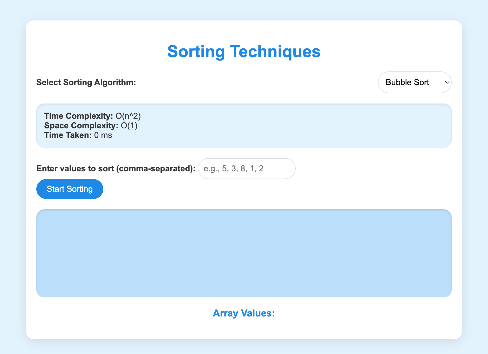

# sorting-techniques

---

# Sorting Algorithm Visualization

## Overview

This project provides an interactive webpage to visualize various sorting algorithms. Users can select different sorting algorithms from a dropdown menu, input their own values to sort, and observe the sorting process through dynamic bar visualizations. The webpage also displays relevant information about time and space complexity for each algorithm.

## Features

- **Dynamic Sorting Visualization**: Visualize sorting algorithms with adjustable bar heights.
- **Algorithm Selection**: Choose from Bubble Sort, Insertion Sort, Selection Sort, Merge Sort, and Quick Sort.
- **Input Array**: Enter comma-separated values to be sorted.
- **Complexity Information**: View time and space complexity for each selected algorithm.
- **Performance Measurement**: Track the time taken to sort the input array.

## Technologies Used

- **HTML**: Structure of the webpage.
- **CSS**: Styling of the webpage with a light blue color scheme and modern design.
- **JavaScript**: Sorting algorithm implementations and dynamic updates.

## Getting Started

To run this project locally, follow these steps:

1. **Clone the Repository**:
   ```bash
   git clone https://github.com/yourusername/sorting-algorithm-visualization.git
   ```

2. **Navigate to the Project Directory**:
   ```bash
   cd sorting-algorithm-visualization
   ```

3. **Open the HTML File**:
   - Open `index.html` in your preferred web browser.

## Usage

1. **Input Values**:
   - Enter comma-separated integers in the input field and click the "Start Sorting" button.

2. **Select Sorting Algorithm**:
   - Choose a sorting algorithm from the dropdown menu.

3. **View Visualization**:
   - Observe the bars representing the array values being sorted in real-time.

4. **Check Complexity Information**:
   - View the time and space complexity of the selected algorithm.

5. **Time Taken**:
   - The time taken to complete the sorting process is displayed below the complexity information.

## Algorithms Implemented

- **Bubble Sort**: Repeatedly steps through the list, compares adjacent elements, and swaps them if they are in the wrong order.
- **Insertion Sort**: Builds the final sorted array one item at a time by repeatedly picking the next item and inserting it into the correct position.
- **Selection Sort**: Selects the smallest (or largest) element from the unsorted portion and swaps it with the first unsorted element.
- **Merge Sort**: Divides the array into halves, sorts each half, and then merges the sorted halves.
- **Quick Sort**: Selects a 'pivot' element and partitions the array into elements less than and greater than the pivot, then recursively sorts the partitions.



## License

This project is licensed under the MIT License. See the [LICENSE](LICENSE) file for details.

